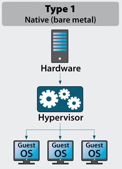
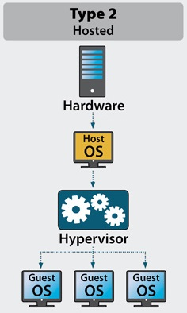

DevOps_online_Kyiv_2021Q3

<h1>Module 1. Task 2.1</h1>
<h3>PART 1. HYPERVISORS</h3>
<h4>1. What are the most popular hypervisors for infrastructure virtualization?</h4>

The most popular hypervisors is <b>Type 1(bare metal)</b> and <b>Type 2(hosted)</b>.
 
Virtualization used to simulate different types of OS. To test product in different kind of environment.

<h4>2. Short description of the main differences between the most popular hypervisors.</h4>

<b>Type 1 hypervisor.</b>
 

 
This type of hypervisor runs directly on physical hardware. That makes that hypervisor more productive than Type 2 and more secure. You don't need to wait until host OS will be loaded. The hardware used straight without interpretation. Type 1 is isolated from other VMs and if it was attacked it don't cause any troubles to another VMs.

<b>Type 2 hypervisor.</b>
 

 
On other side Type 2 runs in host OS. Uses its drivers and host OS manage calls to CPU, RAM, ROM etc. Any security weakness of host OS may affect to VMs which run into that host. For example, this type used to testing software products. Type 2 is cheaper than Type 1 hypervisor.

