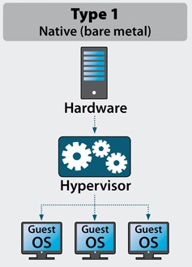
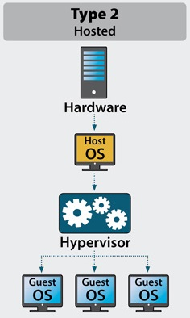

DevOps_online_Kyiv_2021Q3

<h1>Module 2. Task 2.1</h1>
<h3>PART 1. HYPERVISORS</h3>
<h4>1. What are the most popular hypervisors for infrastructure virtualization?</h4>

The most popular hypervisors is <b>Type 1(bare metal)</b> and <b>Type 2(hosted)</b>.
 
Virtualization used to simulate different types of OS. To test product in different kind of environment.

<h4>2. Short description of the main differences between the most popular hypervisors.</h4>

<b>Type 1 hypervisor.</b>
 

 
This type of hypervisor runs directly on physical hardware. That makes that hypervisor more productive than Type 2 and more secure. You don't need to wait until host OS will be loaded. The hardware used straight without interpretation. Type 1 is isolated from other VMs and if it was attacked it don't cause any troubles to another VMs.

<b>Type 2 hypervisor.</b>
 

 
On other side Type 2 runs in host OS. Uses its drivers and host OS manage calls to CPU, RAM, ROM etc. Any security weakness of host OS may affect to VMs which run into that host. For example, this type used to testing software products. Type 2 is cheaper than Type 1 hypervisor.

<h4>Some screenshots during studying VirtualBox:</h4>

Export virtual machine.

Export virtual machine.

Import virtual machine.

Ping host with NAT network adapter.

Ping in different settings of network adapter.

<h4>Table of possible connections.</h4><table  border="1"><colgroup><col align="left"><col align="center"><col align="center"><col align="center"><col align="center"><col align="center"></colgroup><thead valign="middle"><tr><th align="left"><strong>Mode</strong></th><th align="center">

                <strong>VM&#8594;Host</strong>
              
</th><th align="center">

                <strong>VM&#8592;Host</strong>
              
</th><th align="center">

                <strong>VM1&#8596;VM2</strong>
              
</th><th align="center">

                <strong>VM&#8594;Net/LAN</strong>
              
</th><th align="center">

                <strong>VM&#8592;Net/LAN</strong>
              
</th></tr></thead><tbody valign="middle"><tr><td align="left">

                Host-only
              
</td><td align="center">

                <strong>+</strong>
              
</td><td align="center">

                <strong>+</strong>
              
</td><td align="center">

                <strong>+</strong>
              
</td><td align="center">

                &#8211;
              
</td><td align="center">

                &#8211;
              
</td></tr><tr><td align="left">

                Internal
              
</td><td align="center">

                &#8211;
              
</td><td align="center">

                &#8211;
              
</td><td align="center">

                <strong>+</strong>
              
</td><td align="center">

                &#8211;
              
</td><td align="center">

                &#8211;
              
</td></tr><tr><td align="left">

                Bridged
              
</td><td align="center">

                <strong>+</strong>
              
</td><td align="center">

                <strong>+</strong>
              
</td><td align="center">

                <strong>+</strong>
              
</td><td align="center">

                <strong>+</strong>
              
</td><td align="center">

                <strong>+</strong>
              
</td></tr><tr><td align="left">

                NAT
              
</td><td align="center">

                <strong>+</strong>
              
</td><td align="center">

                <a href="https://www.virtualbox.org/manual/ch06.html#natforward" title="6.3.1. Configuring Port Forwarding with NAT">Port forward</a>
              
</td><td align="center">

                &#8211;
              
</td><td align="center">

                <strong>+</strong>
              
</td><td align="center">

                <a href="https://www.virtualbox.org/manual/ch06.html#natforward" title="6.3.1. Configuring Port Forwarding with NAT">Port forward</a>
              
</td></tr><tr><td align="left">

                NATservice
              
</td><td align="center">

                <strong>+</strong>
              
</td><td align="center">

                <a href="https://www.virtualbox.org/manual/ch06.html#network_nat_service" title="6.4. Network Address Translation Service">Port forward</a>
              
</td><td align="center">

                <strong>+</strong>
              
</td><td align="center">

                <strong>+</strong>
              
</td><td align="center">

                <a href="https://www.virtualbox.org/manual/ch06.html#network_nat_service" title="6.4. Network Address Translation Service">Port forward</a>
              
</td></tr></tbody></table>

<h4>Vagrant.</h4>

Solving an issue with my old laptop.

Vagrant VM execution, stopping and destroying.

Date command output in VM starded by Vagrant.

