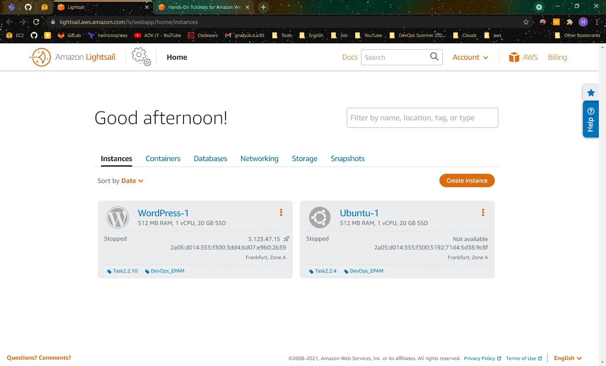
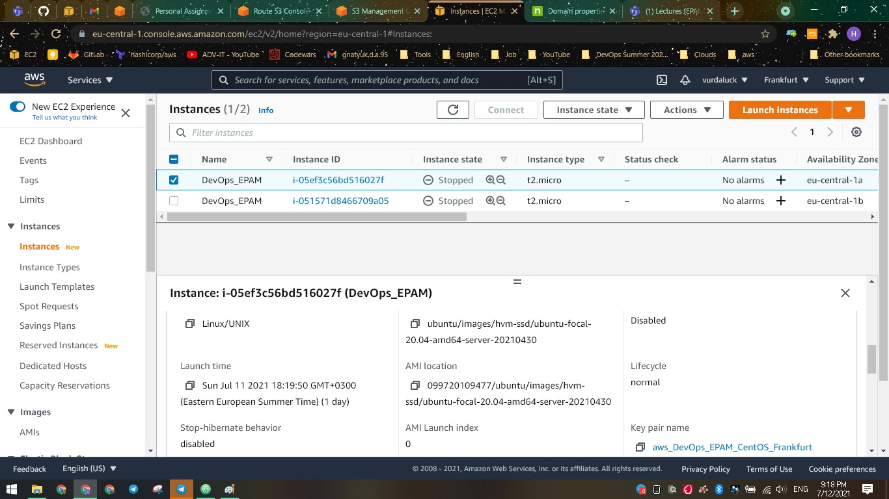
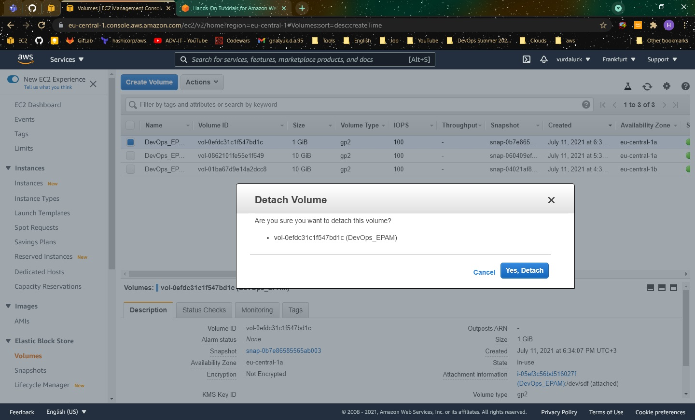
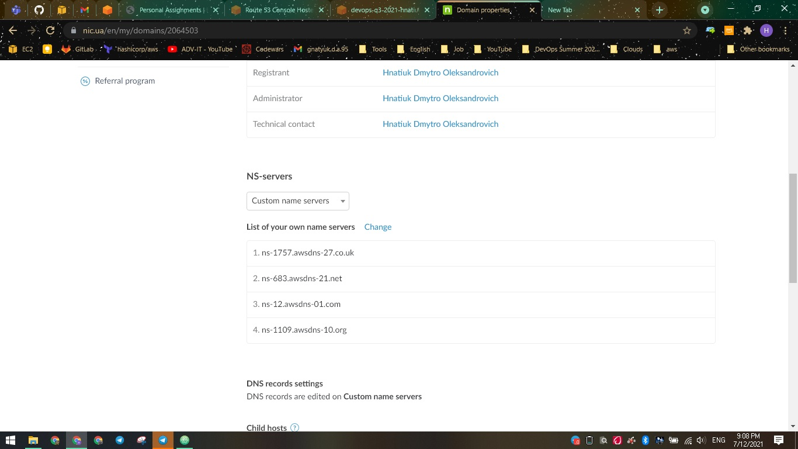

DevOps_online_Kyiv_2021Q3

<h1>Module 2. Task 2.2</h1>
<h3>Screenshots work on AWS:</h3>

  
   
   
  
   
   
  
   
  Here have been a trouble with connection to another instance. Availability Zone was different. So I created snapshot, restore it on another AZ and connect it
   
   
  
      
       
     
     
  
   

