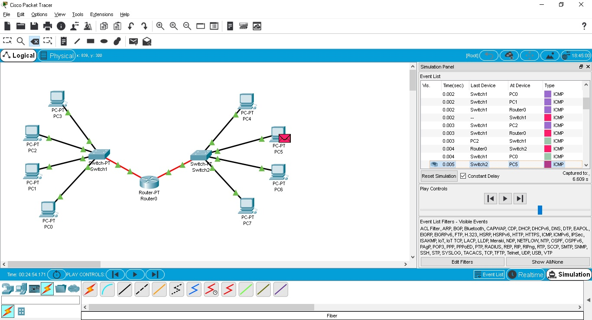

DevOps_online_Kyiv_2021Q3

<h1>Module 4. Task 4.1</h1>
<h2>NetworkingFundamentals</h2>

<a href="https://github.com/vurdaLUCK/DevOps_online_Kyiv_2021Q3/tree/main/m4/task4.1/files" title="Files">Cisco Packet Tracer files.</a>
 
 

 
Task 4.1.2
 
 

 
Task 4.1.5
 
 

 
Task 4.1.5(1)
 
 

 
Task 4.1.8
 
 

 
Task 4.1.11
 
 

 
Task 4.1.13
 
 

 
Task 4.1.13
 
 

 
Task 4.1.22

