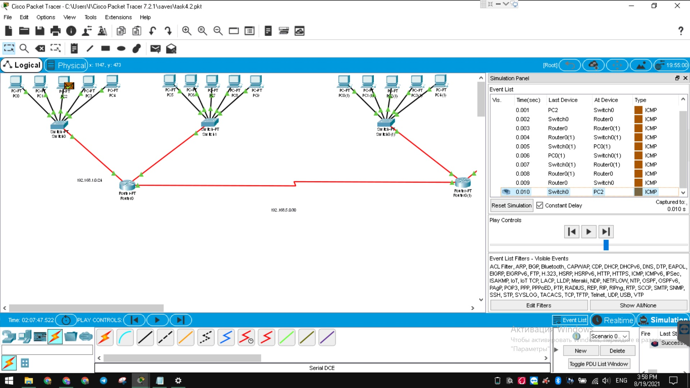
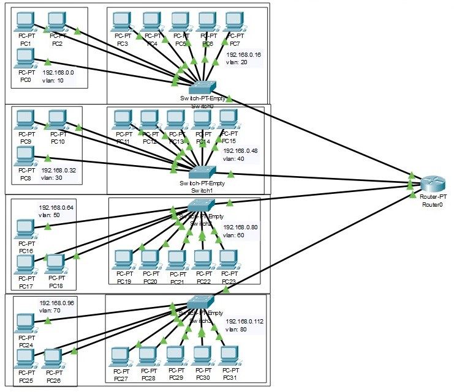
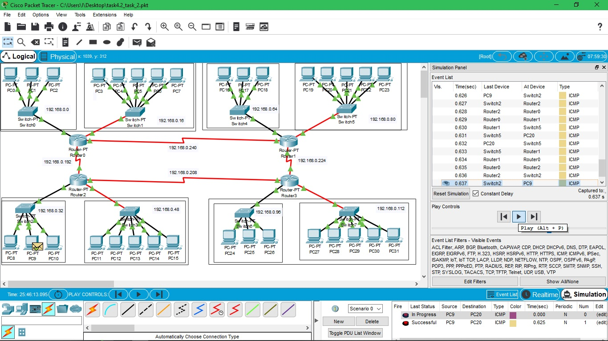
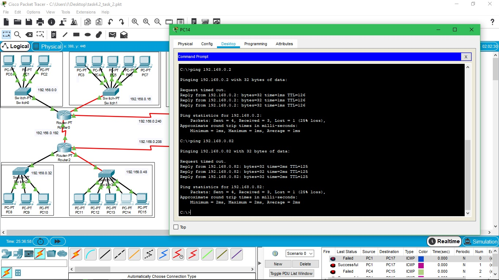
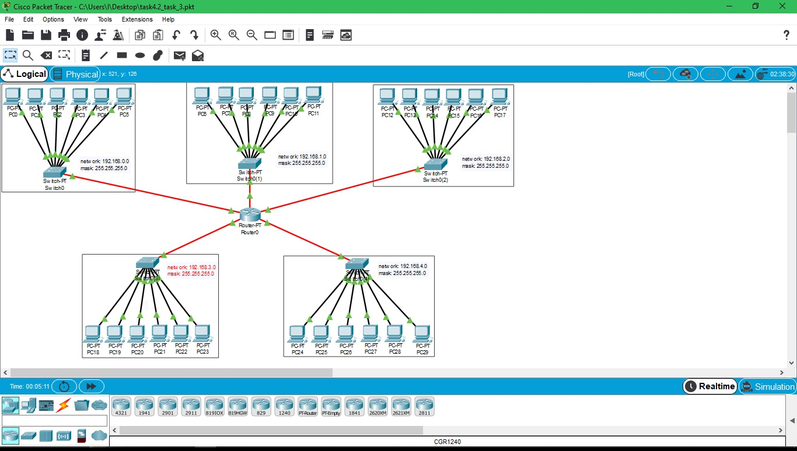

DevOps_online_Kyiv_2021Q3

<h1>Module 4. Task 4.2</h1>
<h2>NetworkingFundamentals</h2>
 
<a href="https://github.com/vurdaLUCK/DevOps_online_Kyiv_2021Q3/tree/main/m4/task4.2/files" title="Files">Cisco Packet Tracer files.</a>

<h3>Task 1. Modeling logical structure of corporate network for 2 buildings with 2 floors, each floor contain 5 computers.</h3>

 
Created 5 networks.
 

Router console

Router>en 
Router#conf t 
Enter configuration commands, one per line.  End with CNTL/Z. 
Router(config)#int f0/0 
Router(config-if)#ip add 192.168.0.33 255.255.255.240 
Router(config-if)#no shut 
Router(config-if)# 
%LINK-5-CHANGED: Interface FastEthernet0/0, changed state to up 
%LINEPROTO-5-UPDOWN: Line protocol on Interface FastEthernet0/0, changed state to up 

<h3>Task 2. Modeling logical structure of corporate network for building with 4 floors with 2 workgroup each by 3 and 5 computers.</h3>
<h4>Variant 1.</h4>

 
Created 8 VLAN 1 for each workgroup, 1 switch for each floor
 
Netmask: 255.255.255.240

<h4>Variant 2.</h4>

 
Created 12 subnetworks, 8 workgroups 2 per floor, used 4 routers 1 for each floor. On each router set up ospf routing protocol to give access between any computers in building.
 
Netmask: 255.255.255.240

Show screenshots

 
Ping to few computers in different subnetworks.

Setting up OSPF routing protocol

Router>en 
Router#conf t 
Enter configuration commands, one per line.  End with CNTL/Z. 
Router(config)#rou 
Router(config)#router ospf 3 
Router(config-router)#network 192.168.0.224 0.0.0.15 area 0 
Router(config-router)#network 192.168.0.112 0.0.0.15 area 0 
Router(config-router)#network 192.168.0.96 0.0.0.15 area 0 
Router(config-router)#network 192.168.0.208 0.0.0.15 area 0 
Router(config-router)# 

<h3>Task 3. Modeling logical structure of 5 1 floor buildings, 6 PCs in each.</h3>
 

 
Setup DHCP servers with different networks per building for each interface. Connected 5 buildings.
 
 

Router console

Router>en 
Router#conf t 
Enter configuration commands, one per line.  End with CNTL/Z. 
Router(config)#int fa4/0 
Router(config-if)#ip add 192.168.0.1 255.255.255.0 
Router(config-if)#no shut 
Router(config-if)#ex 
Router(config)#ip dhcp pool MY_LAN 
Router(dhcp-config)#network 192.168.0.0 255.255.255.0 
Router(dhcp-config)#def 
Router(dhcp-config)#default-router 192.168.0.1 
Router(dhcp-config)#dn 
Router(dhcp-config)#dns-server 192.168.0.10 
Router(dhcp-config)#ex 
Router(config)#ip dhcp ex 
Router(config)#ip dhcp excluded-address 192.168.0.1 192.168.0.10 
Router(config)# 

