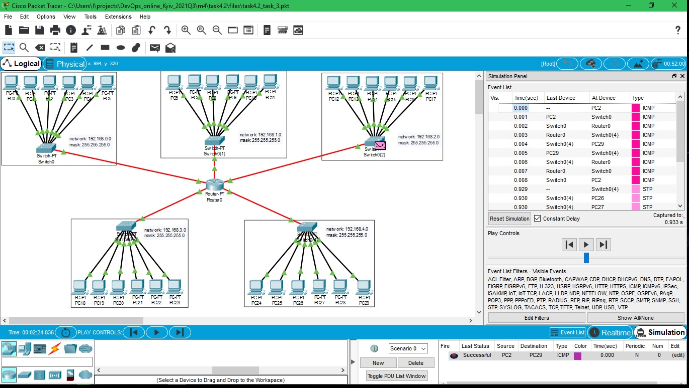

DevOps_online_Kyiv_2021Q3

<h1>Module 4. Task 4.2</h1>
<h2>NetworkingFundamentals</h2>
 
<a href="https://github.com/vurdaLUCK/DevOps_online_Kyiv_2021Q3/tree/main/m4/task4.2/files" title="Files">Cisco Packet Tracer files.</a>

<h3>Task 1. Modeling corporate network for 2 buildings with 2 flours, each flour contain 5 computers.</h3>

Show

 

 
Created 5 networks.
 

Router console

<h3>Task 2. .</h3>

Show

 

 
Created .
 

Router console

<h3>Task 3. .</h3>

Show

 

 
Created .
 

Router console

