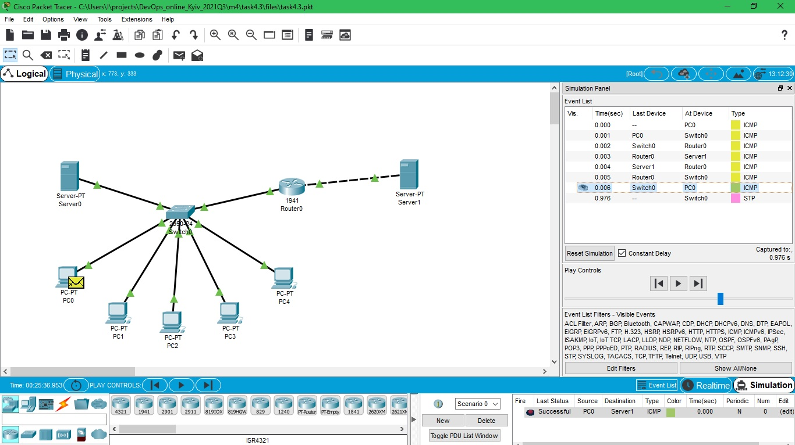
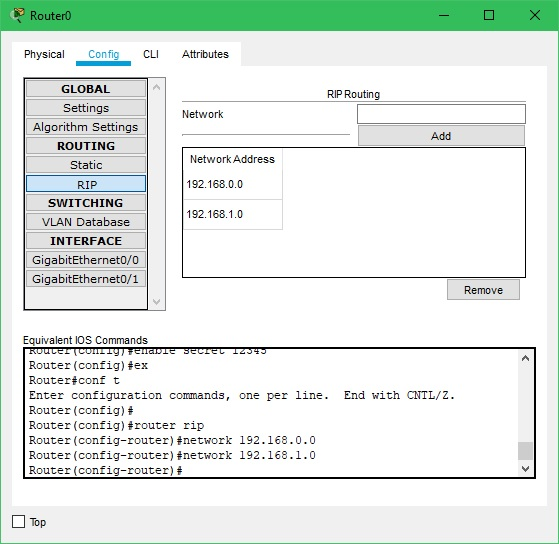
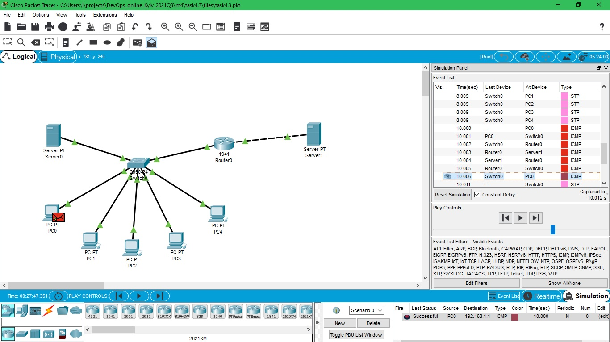

DevOps_online_Kyiv_2021Q3

<h1>Module 4. Task 4.3.</h1>
<h2>Networking Fundamentals</h2>
 
<a href="https://github.com/vurdaLUCK/DevOps_online_Kyiv_2021Q3/tree/main/m4/task4.3/files" title="Files">Cisco Packet Tracer files.</a>

<h3>Task 1. Model local network switch connected to 5 PC and Server, switch connected to router which connected to another server.</h3>

 
Created local network with 5 PC and Server connected to switch from the one side of router and Server, from second.
 
 

 
Setted up RIP routing between 2 networks.
 
 

 
Checked connection by sending sinple PDU.
 

