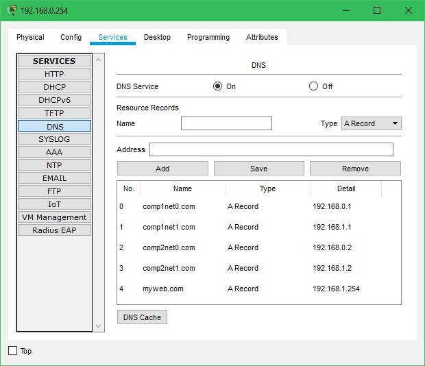
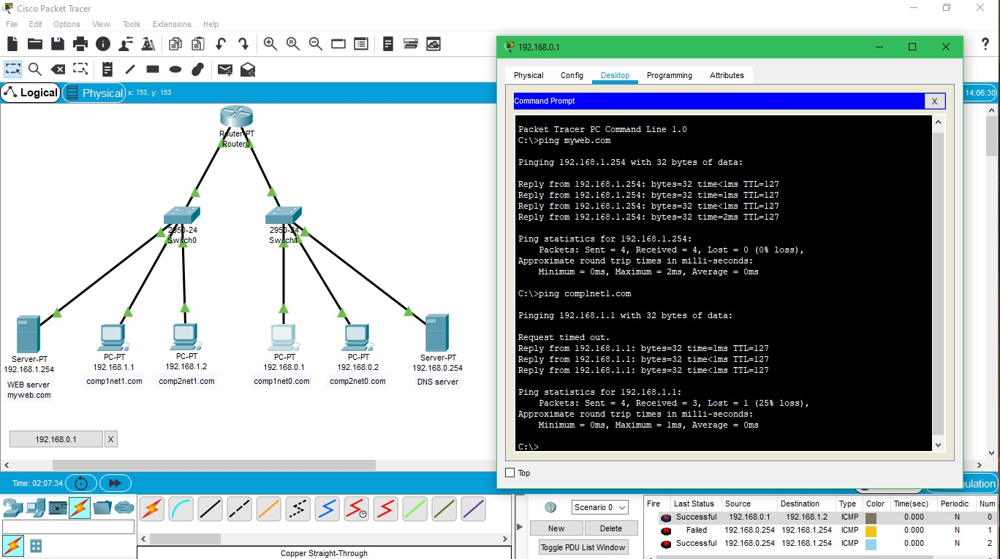
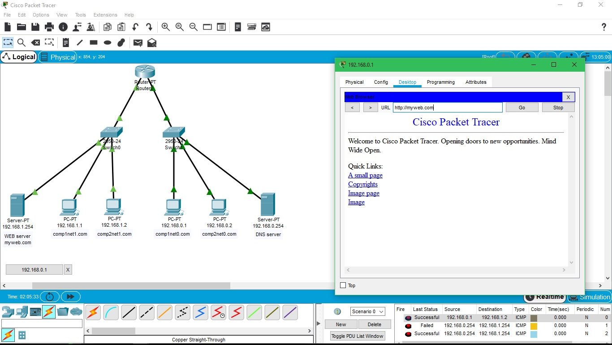

DevOps_online_Kyiv_2021Q3

<h1>Module 4. Task 4.4.</h1>
<h2>Networking Fundamentals</h2>
 
<a href="https://github.com/vurdaLUCK/DevOps_online_Kyiv_2021Q3/tree/main/m4/task4.3/files" title="Files">Cisco Packet Tracer files.</a>

<h3>Task 2. Setup DNS servers.</h3>

 
Setted up DNS server and created DNS table.
 
 

 
Ping from 192.168.0.1 to myweb.com and comp1net1.com.
 
 

 
Test connection to myweb.com.
 
 

